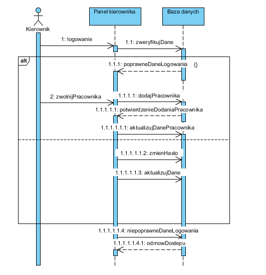
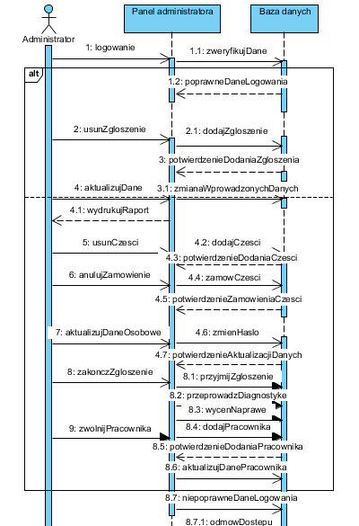
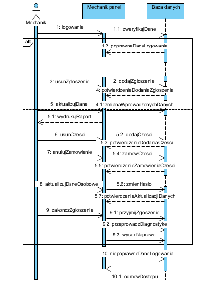
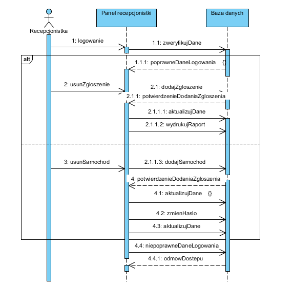
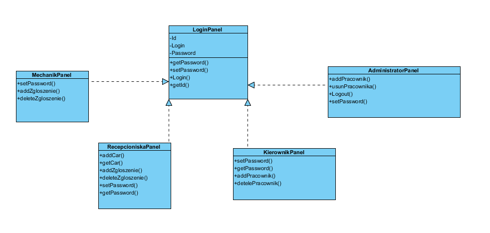
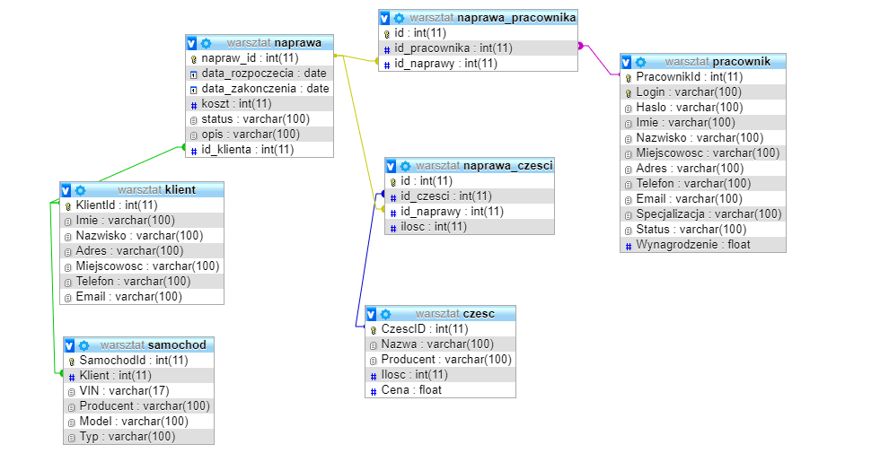

# -Programowanie_zespolowe_2018_gr2

Warsztat samochodowy napisany w JavaFX 

# Aplikacja będzie miała za zadaie obsługiwanie klientów oraz przebieg napraw. Będziemy mieli możliwość:
dodawanie, usuwanie, edycje, podgląd pracowników
dodawanie, usuwanie, edycje, podgląd zamówień klientów
dodawanie, usuwanie, edycje, podgląd napraw
wyświetlanie przydzielonych napraw do danego pracownika
sprawdzenie stanu magazynu z częsciami
zarządzanie kontem
drukowanie raportu PDF odnośnie realizacji zamówień

# Aplikacja będzie posiadać następujące grupy użytkowników:
1. kierownik: dostęp do zarządzania swoim kontem (zmiana hasła, aktualizacja danych), przegląd pracowników (dodawanie, usuwanie, aktualizowanie)
1. recepcjonistka: przegląd, dodawanie, usuwanie zgłoszeń,, wydrukowanie raportu, aktualizacja danych
1. administrator: dostęp do zarządzania wszystkimi pracownikami
1. mechanik: dostęp do zarządzania swoim kontem, przegląd napraw, przegląd części w magazynie

# Narzędzia

Jira
GitHub
GitHub Desktop
Git Extensions
JavaFx
NetBeans

# Diagram UML

# Diagram przypadków użycia

# Diagram sekwencji dla każdego użytkownika systemu

# Diagram klas

# Diagram ERD

